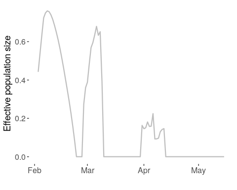

Combining trajectories in regions
================

Demonstrated using the North East, as there are only three lineages that
appear in the North East:

<!-- -->

The lineages that appear in the North East are

    ## UK214 UK2735 UK2916

We allocate the lineages’ trajectories to the North East according to
the extent to which they were in the North East vs. other regions, by
(a) spreading each sample over up to seven days, (b) filling in any
empty days linearly from a non-zero neighbouring day, and (c)
normalising each day, so that on each day the lineage’s effective
population is distributed between the constituent regions:

<!-- -->

And here are the trajectories for the three:

<!-- -->

We write the effective population size as the weighted sum of the
lineages:

<!-- -->

# All regions

The effective population size over all lineages for the North East is
noisy, but also very small. It’s larger for other regions (all
trajectories smoothed as seven-day average):

<!-- -->

Effective growth rates and effective reproduction numbers are combined
similarly, weighted by (smoothed) effective population sizes, and then
smoothed in turn.

Effective growth rates:

<!-- -->
Effective reproduction numbers:

<!-- -->
